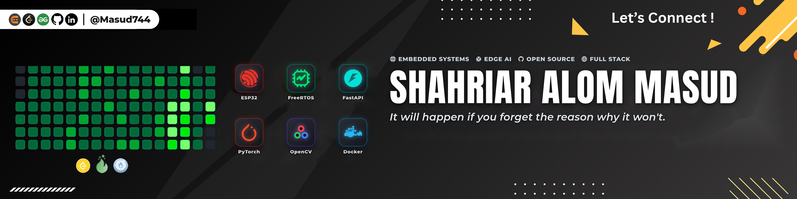

  

<h1 align="center"> Hi there, I'm <a href="https://www.linkedin.com/in/shahriar-alom-masud">Shahriar Alom Masud</a> </h1>

-  **Currently building and developing Myself**  
- About Me: **Embedded Systems & Edge AI Engineer**  
-  Value **clarity, ownership, fault-tolerance, and continuous improvement**  
-  Open Source: Author of **[SmartProv (v2.1.3)](https://github.com/Masud744/SmartProv)** on official **Arduino Library Manager**  
-  Skills: **Python, C/C++, FreeRTOS, FastAPI, ONNX Runtime, OpenCV, Docker**  
-  Reach Me At: [shahriar0002@std.uftb.ac.bd](mailto:shahriar0002@std.uftb.ac.bd)  
-  **Location:** Dhaka, Bangladesh  

 
 

---

## 🛠️ Technical Arsenal

###  Programming Languages

  
  
  
  
  
  
  

### ⚡ Embedded Systems, Firmware & Protocols

  
  
  
  
  
  
  
  
  

###  Edge AI, Machine Learning & Computer Vision

  
  
  
  
  
  
  

###  Cloud, Backend & Databases

  
  
  
  
  
  
  
  

###  Frontend & Visualization

  
  
  
  
  
  

###  DevOps, Automation & Workflow Tools

  
  
  
  
  
  

---

##  Featured Flagship Projects

<table>
  <tr>
    <td width="50%" valign="top">
      <h3>🌟 <a href="https://github.com/Masud744/SmartProv">SmartProv (v2.1.3)</a></h3>
      
<b>Official Arduino Library Manager Package</b>

      
An asynchronous, event-driven captive-portal Wi-Fi provisioning framework for ESP32 and ESP8266 microcontrollers. Engineered non-volatile NVS flash persistence with automated fallback routines, eliminating manual credential flashing across 100% of device deployments.

      

        
        
        
        
      

      
🔗 <a href="https://github.com/Masud744/SmartProv"><b>View Repository</b></a> &bull; <a href="https://github.com/Masud744/esp32-smartprov-github-ota"><b>OTA Companion System</b></a>

    </td>
    <td width="50%" valign="top">
      <h3> <a href="https://github.com/Masud744/ProctorAI">ProctorAI</a></h3>
      
<b>Full-Stack AI Classroom & Exam Proctoring Platform</b>

      
Real-time computer vision platform tracking eye gaze (EAR), mouth ratio (MAR), phone presence, and 3D head pose via solvePnP at 30–60 FPS. Validated across <b>35+ students and 3,500+ telemetry records</b> with FastAPI and Supabase PostgreSQL backend.

      

        
        
        
        
      

      
🔗 <a href="https://github.com/Masud744/ProctorAI"><b>View Repository</b></a> &bull;  <a href="https://ai-classroom-exam-monitoring.netlify.app"><b>Live Dashboard</b></a>

    </td>
  </tr>

  <tr>
    <td width="50%" valign="top">
      <h3>🫁 <a href="https://github.com/Masud744/RespiGuard">RespiGuard</a></h3>
      
<b>Explainable Edge AI Respiratory Risk Monitoring System</b>

      
Investigational edge healthcare platform fusing ESP32 environmental sensing (PMS5003 laser particulate, MQ-135, DHT22) running FreeRTOS with outdoor meteorology. Uses dynamic TreeSHAP local waterfall attributions, interactive Leaflet dispersion mapping, and Groq LLaMA 3.3 AI copilot.

      

        
        
        
        
      

      
🔗 <a href="https://github.com/Masud744/RespiGuard"><b>View Repository</b></a> &bull; 🌐 <a href="https://respiguard-fvh9.onrender.com/"><b>Live App</b></a>

    </td>
    <td width="50%" valign="top">
      <h3>☀️ <a href="https://github.com/Masud744/solar-aware-hems">Solar-Aware HEMS</a></h3>
      
<b>Risk-Aware Smart Home Energy Management System</b>

      
Time-series forecasting pipeline predicting solar yield and household load via quantile regression and empirical uncertainty margins (kσ) to calculate Safe Solar Surplus. Deployed with dual-layer TreeSHAP explanations and ESP32 discrete RMS power telemetry.

      

        
        
        
        
      

      
🔗 <a href="https://github.com/Masud744/solar-aware-hems"><b>View Repository</b></a> &bull; 🌐 <a href="https://solar-aware-hems.vercel.app"><b>Live Analytics</b></a>

    </td>
  </tr>

  <tr>
    <td width="50%" valign="top">
      <h3>🧠 <a href="https://github.com/Masud744/oncoscan-ai">OncoScan AI</a></h3>
      
<b>Explainable Brain Tumor Diagnostic Platform</b>

      
Deep Convolutional Neural Network classifying brain MRI scans into 4 categories with &gt;90% accuracy. Optimized with ONNX Runtime to slash inference latency by ~4&times;, featuring Grad-CAM clinical heatmaps and automated PDF diagnostic reporting.

      

        
        
        
        
      

      
🔗 <a href="https://github.com/Masud744/oncoscan-ai"><b>View Repository</b></a> &bull; 🌐 <a href="https://oncoscan-ai.netlify.app/"><b>Live Diagnostic Tool</b></a>

    </td>
    <td width="50%" valign="top">
      <h3>🐟 <a href="https://github.com/Masud744/smart-pond-xai">Smart Pond XAI</a></h3>
      
<b>Autonomous IoT Catamaran & Aquaculture AI System</b>

      
Autonomous smart boat engineered with dual-controller architecture (ESP32 + Arduino Mega 2560), long-range LoRa (SX1278) telemetry, automated servo feeding, InfluxDB Cloud time-series storage, and TreeSHAP-explained fish species suitability prediction.

      

        
        
        
        
      

      
🔗 <a href="https://github.com/Masud744/smart-pond-xai"><b>View Repository</b></a> &bull; 🌐 <a href="https://smart-pond-xai1.vercel.app/"><b>Live Telemetry</b></a>

    </td>
  </tr>

  <tr>
    <td width="50%" valign="top">
      <h3>🤖 <a href="https://github.com/Masud744/linkedin-content-automation-n8n">LinkedIn Automation Workflow</a> ⭐ 11</h3>
      
<b>Autonomous AI Content Publishing Pipeline</b>

      
Event-driven n8n automation pipeline that orchestrates AI models for topic discovery, caption drafting, image synthesis, and scheduled direct-to-LinkedIn publishing, cutting manual creation overhead by ~80%.

      

        
        
        
        
      

      
🔗 <a href="https://github.com/Masud744/linkedin-content-automation-n8n"><b>View Repository</b></a> &bull; <a href="https://github.com/Masud744/linkedin-job-scraper-n8n"><b>Job Scraper Workflow</b></a>

    </td>
    <td width="50%" valign="top">
      <h3>⚽ <a href="https://github.com/Masud744/robofusion-robo-soccer-tournament-system">RoboFusion Tournament System</a></h3>
      
<b>Official Live Tournament Bracket & Display Platform</b>

      
Official match scoring and arena display platform engineered for the WALTON Presents RoboFusion 1.0 competition. Built with React 19, Tailwind CSS, live countdown clocks, penalty resolution, and high-contrast projector visuals.

      

        
        
        
      

      
🔗 <a href="https://github.com/Masud744/robofusion-robo-soccer-tournament-system"><b>View Repository</b></a> &bull; 🌐 <a href="https://robofusion-soccer.vercel.app/"><b>Live Arena System</b></a>

    </td>
  </tr>
</table>

---

## 📊 GitHub Analytics & Activity

  
  

  

 

  <picture>
    <source media="(prefers-color-scheme: dark)" srcset="https://raw.githubusercontent.com/masud744/masud744/output/pacman-contribution-graph-dark.svg">
    
  </picture>

---

## 🤝 Let's Connect & Collaborate!

  &nbsp;&nbsp;&nbsp;&nbsp;
  &nbsp;&nbsp;&nbsp;&nbsp;
  &nbsp;&nbsp;&nbsp;&nbsp;
  &nbsp;&nbsp;&nbsp;&nbsp;
  &nbsp;&nbsp;&nbsp;&nbsp;
  

  <i>"Passionate about turning hardware signals into intelligent systems and clean code into real-world impact."</i>

